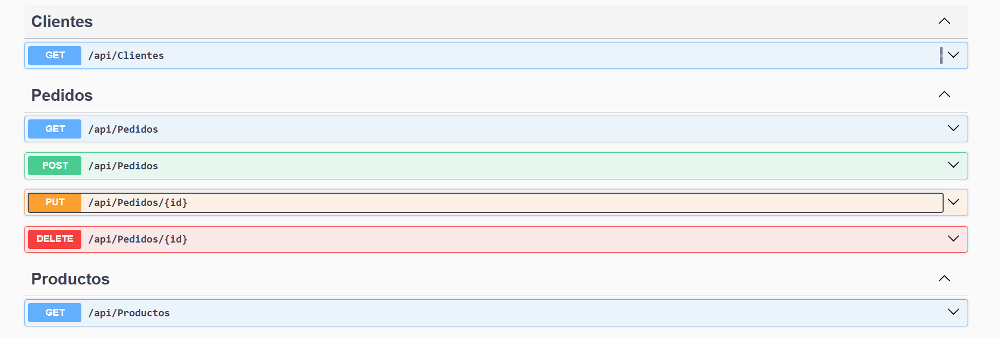

# Backend

<!-- Instrucciones para ejecutar el backend -->

## 🚀 Ejecutar el proyecto (.NET Web API) en Visual Studio

1. Abrir el archivo de solución `ApiRest.sln` en **Visual Studio**.
2. Seleccionar el proyecto Web API como **proyecto de inicio**.
3. Verificar el archivo `appsettings.json` y configurar la cadena de conexión si es necesario.
4. Presionar **F5** o el botón ▶️ **Iniciar depuración**.
5. El backend se ejecutará en:
   - `https://localhost:7016`
   - `http://localhost:5126`
6. Abrir en el navegador:
   - `https://localhost:7016/swagger` para probar la API.

