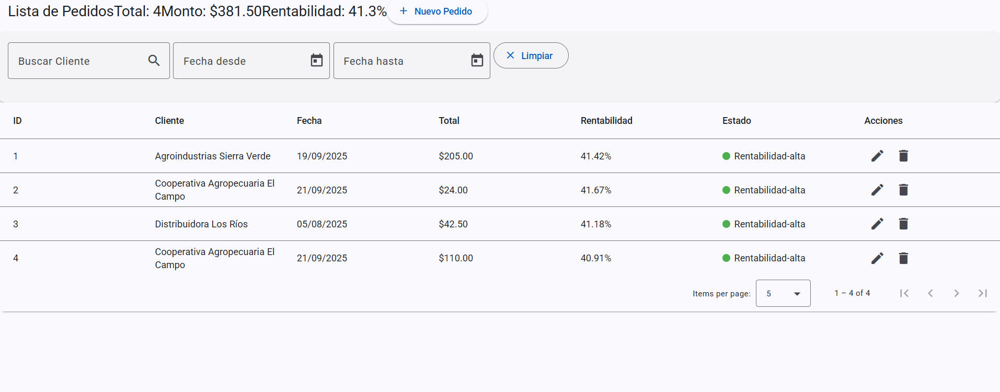
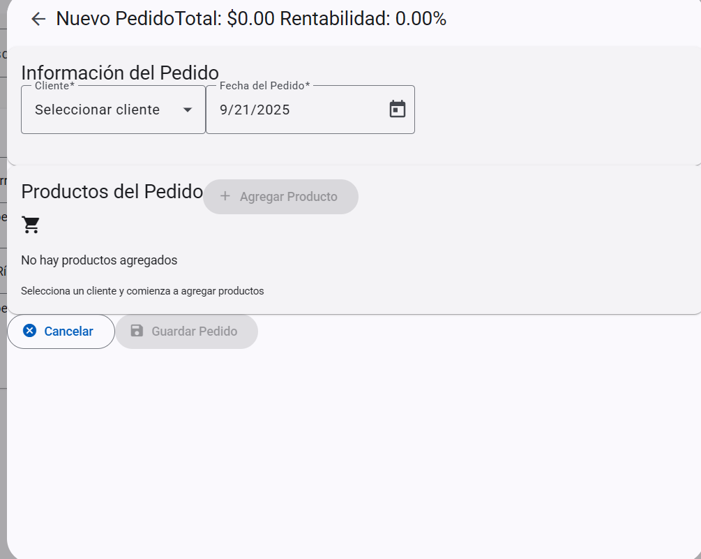
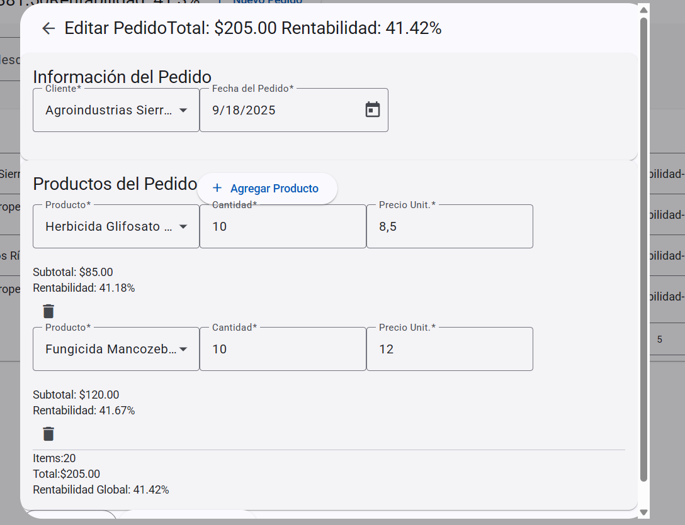

# Frontend

<!-- Instrucciones para ejecutar el frontend -->


````markdown
# 🚀 Proyecto Angular

Este proyecto está desarrollado con **Angular** y puede ejecutarse usando **Bun**, aunque también es compatible con **npm** y **pnpm**.

---

## Requisitos

- Node.js o Bun instalado.
- Navegador moderno.
- (Opcional) Angular CLI para comandos adicionales.

---

## Ejecutar el proyecto con Bun

1. Clonar el repositorio:
   ```bash
   git clone https://github.com/tu-usuario/tu-proyecto.git
   cd tu-proyecto
````

2. Instalar las dependencias:

   ```bash
   bun install
   ```
3. Ejecutar el proyecto en modo desarrollo:

   ```bash
   bun run start
   ```
4. Abrir el navegador en:

   * `http://localhost:4200`
5. Para compilar el proyecto para producción:

   ```bash
   bun run build
   ```

   > El resultado se guardará en la carpeta `dist/`.

---

## Alternativa si no usas Bun

### Con npm:

```bash
npm install
npm run start
npm run build
```

### Con pnpm:

```bash
pnpm install
pnpm run start
pnpm run build
```

> El comportamiento es el mismo:
>
> * Desarrollo: `http://localhost:4200`
> * Producción: carpeta `dist/`

---

## Cambiar el puerto u otras opciones

Puedes pasar flags adicionales al comando de inicio:

```bash
bun run start -- --port 4300
npm run start -- --port 4300
pnpm run start -- --port 4300
```

---

## Notas

* Bun es compatible con la mayoría de scripts de npm, solo que se ejecutan con `bun run <script>`.
* Asegúrate de tener un navegador moderno actualizado.
* Para producción, asegúrate de compilar con `bun run build` (o equivalente) y servir la carpeta `dist/` con un servidor web.

---

## Estructura del proyecto (resumen)

* `src/` → código fuente de Angular
* `angular.json` → configuración de Angular
* `package.json` → scripts y dependencias
* `dist/` → carpeta generada después del build de producción


## Crear

## Editar
